# A review of point cloud registration and its application on Lidar SLAM

点云配准的流程、方法、以及在SLAM 上的应用

大佬发现：在进入一个领域过程中总会有一个在懂基础知识、到看懂Paper再到有自己的想法的过程中会有一个gap，网上很少能找到知识来弥补这方面知识。交流也是一个填平这方面的方法。

# Introduction

### 什么是点云配准

受制于传感器感知范围、等影响，难以一次性地去获取三维世界物体的完整点云描述，需要有多视角，多方位的点云帧来合成完整物体。因此就设定多个点云站对物体进行描述，再使用点云配准算法将各个坐标系下的点云统一到同一。

## General Solution

第一步：Determine Correspondences(确定对应基元)

* 可以是对应的点、线、面、目标。
* 有提取点、线、面、识别目标的方案。

第二步：Estimate Transformation

* 定义目标函数（一般是残差的形式）
* 优化目标函数
* 方法：SVD分解、Linear least square，Non-linear optimization（LM,GN,GN...）

如果上述两步做的好，理论上来说就是一个比较好的配准算法了。

## Transformeation Estimation

$$
\{ {R^*},{t^*}\}  = \mathop {\arg \min }\limits_{\left\{ {R,t} \right\}} (\sum\limits_i {||R{p_i} + t - {q_i}|{|^2}} )
$$

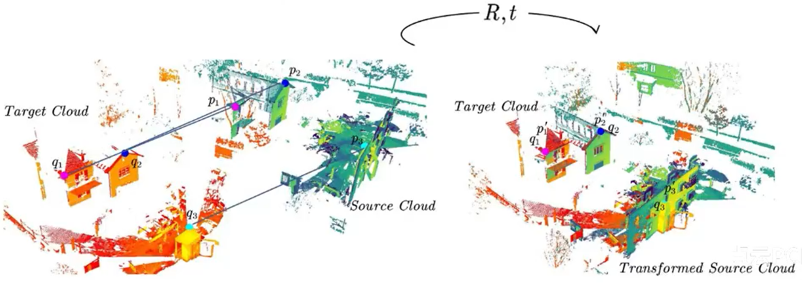
estimation by SVD

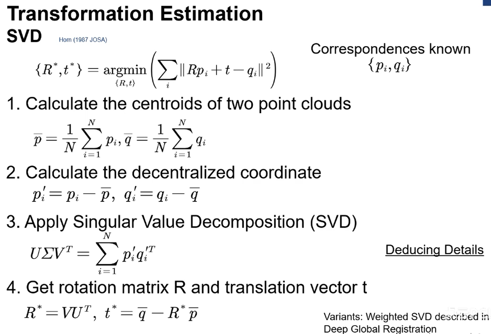

2020CVPR中提到在每个对应点引入权重，再进行SVD进行解算。

by Linear least squire

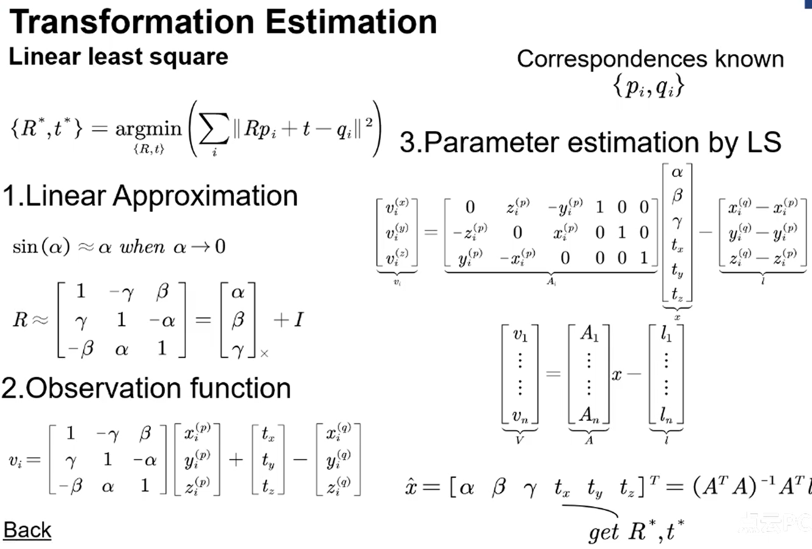

面特征的估计：

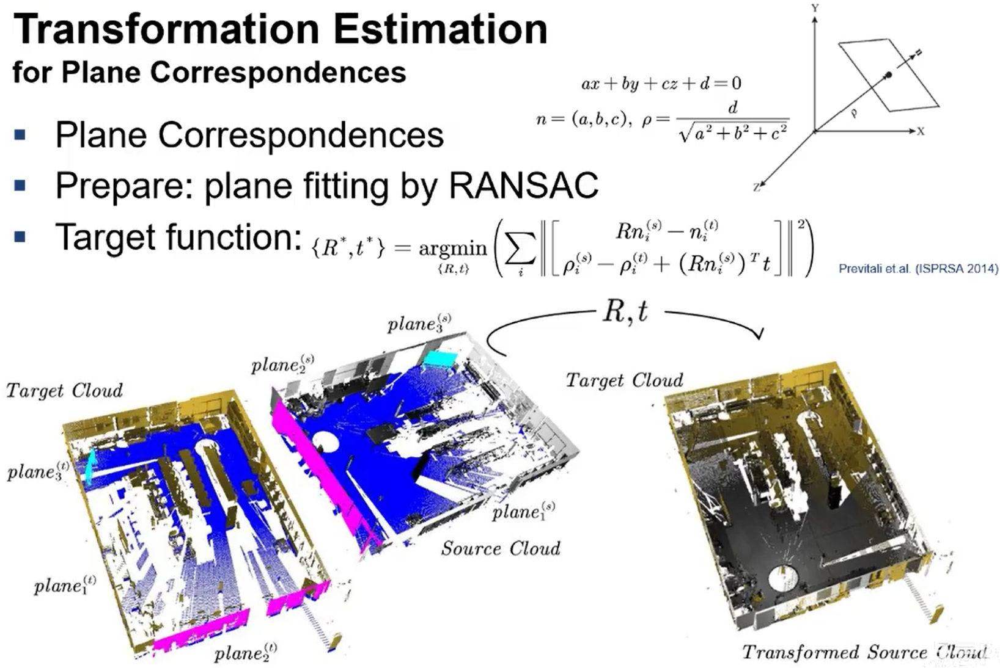

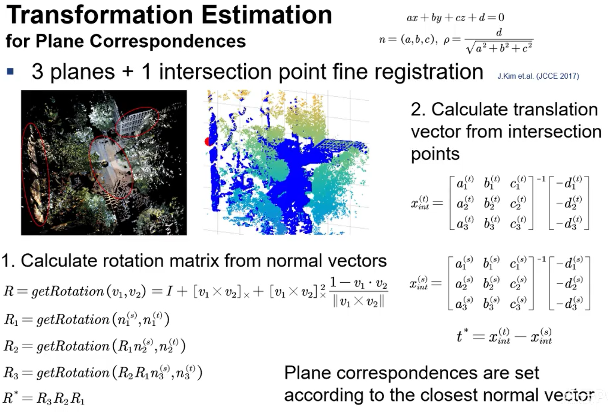

## Determine Correspondences(对应点的获取)

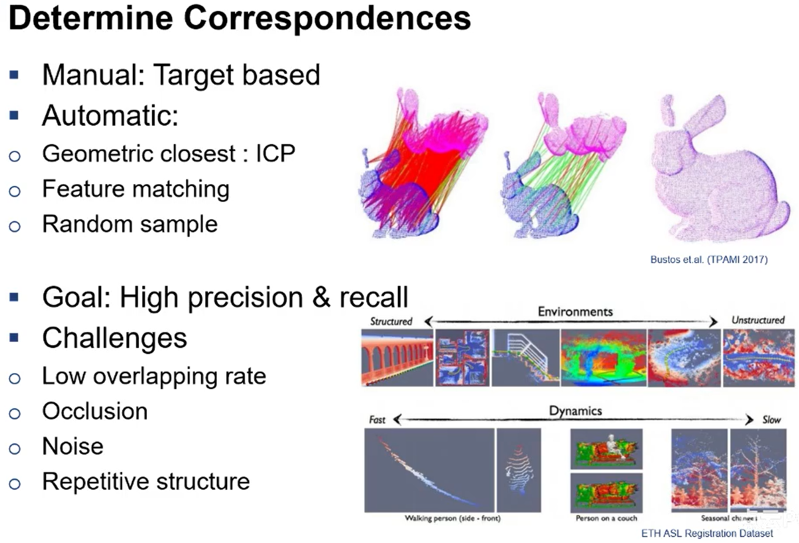

点云重叠区域小、多噪点、太多重复结构怎么办

## Iterative Closest Points(ICP)

Besl et.al(TPAMI 1992)

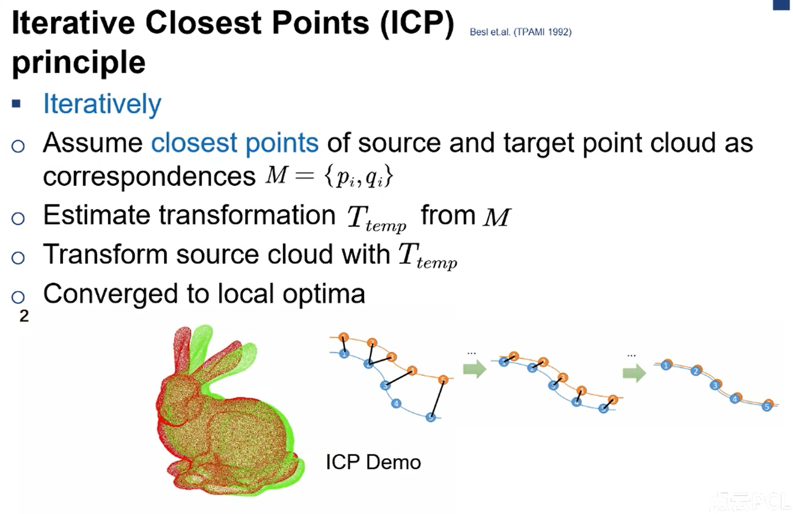

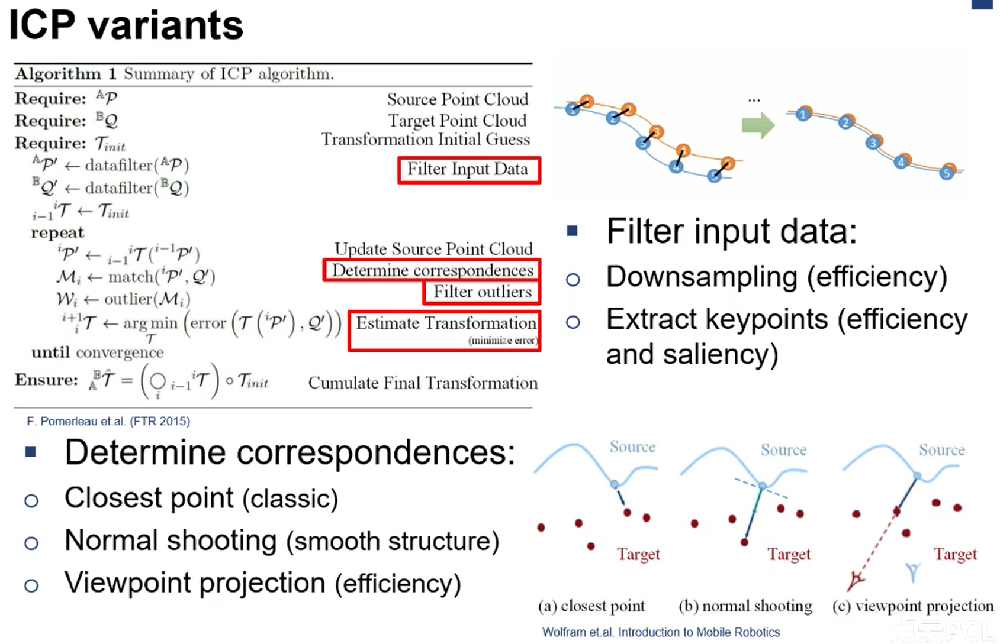

icp算比较老的算法了对应他的各个步骤都有改进创新。

比如：找对应关系、过滤配对关系、距离评价。

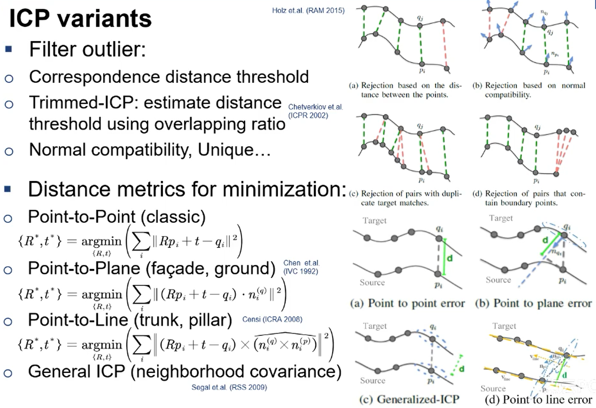

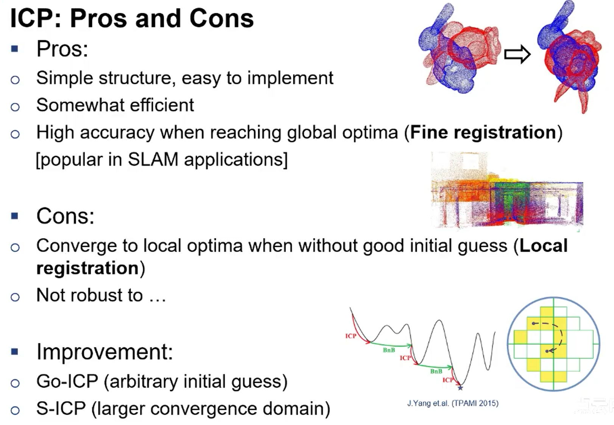

ICP优点和缺点

如果有个较好的初始位姿，可以得到比较精确的解。

否则会陷入局部最优。

Go-icp可跳过局部最优，但可能只适用于兔子一样的小数据。计算量比较大。

S-cicp据说比icp有更大的收敛域，可接受更大的旋转初始位姿。

## Feature matching

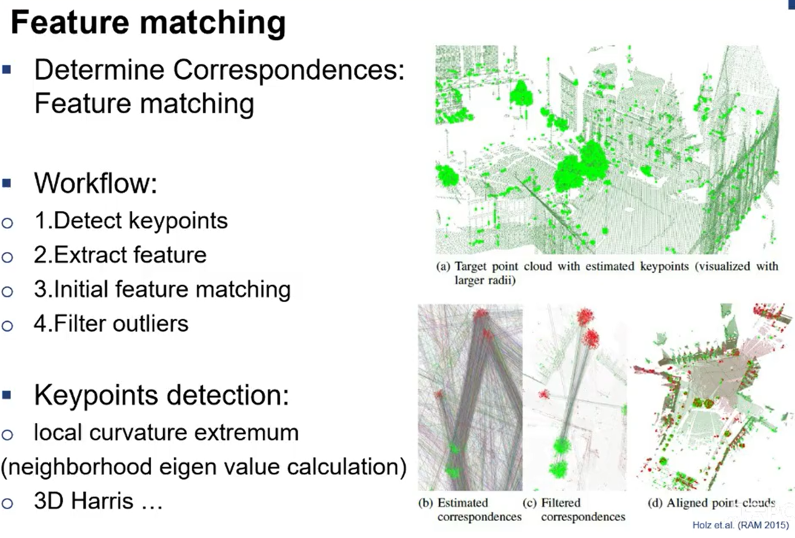

提取寻找特征，做初始的特征匹配。

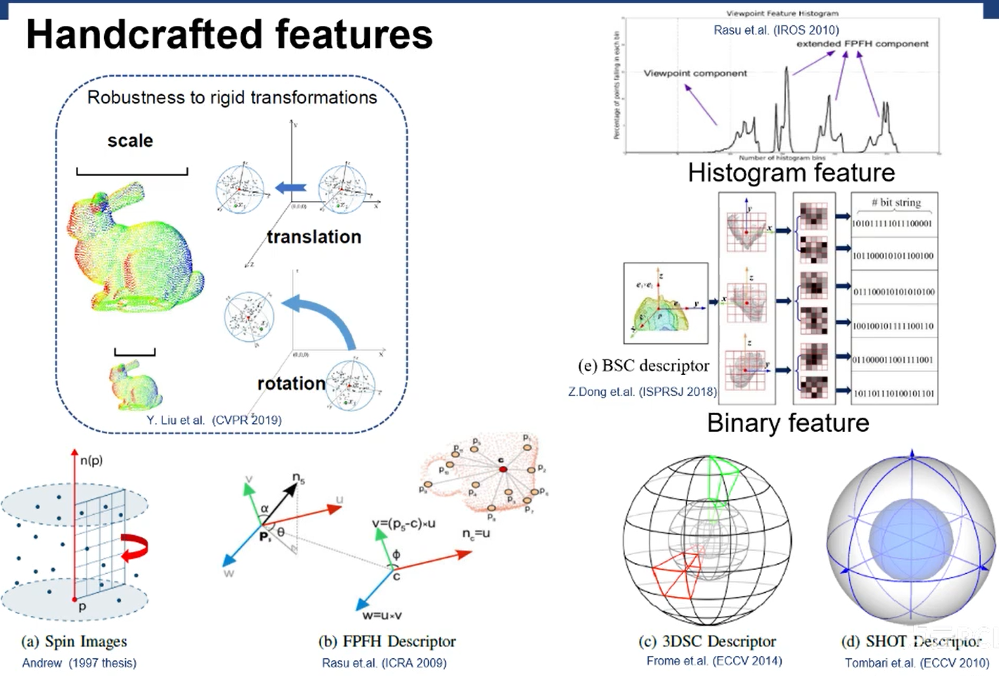

2015前比较火的手工特征，当然现在被deeplearning代替。

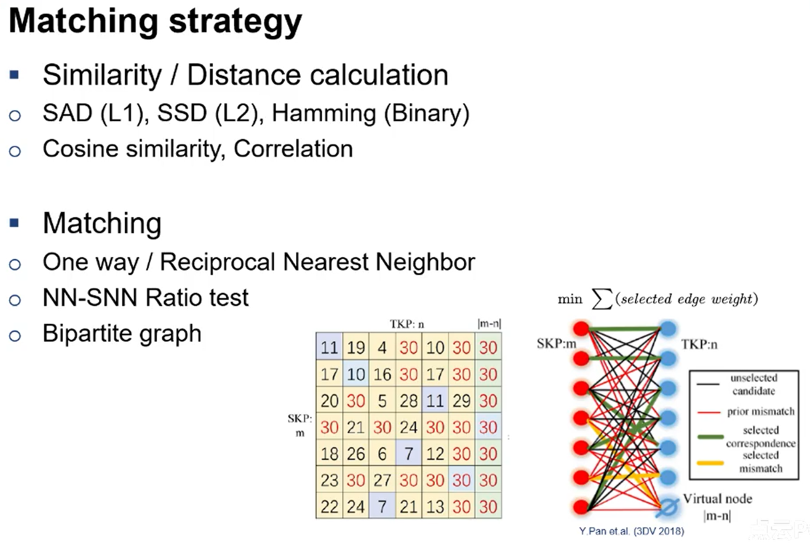

match的机制，计算特征之间的距离、相似度指标。后进行匹配。

单向最近邻、双向、比值等。

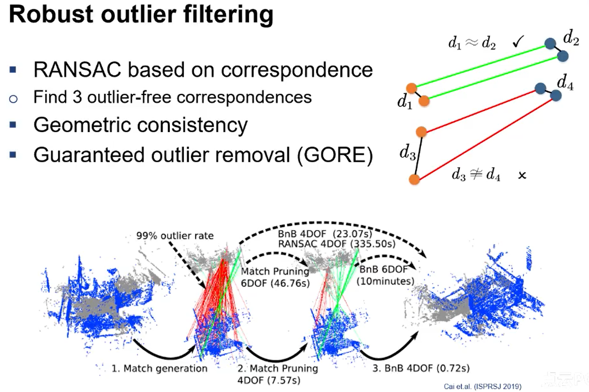对应点的匹配比如考虑几何相似性。如右上角d1=d2.

Learning base

## end
